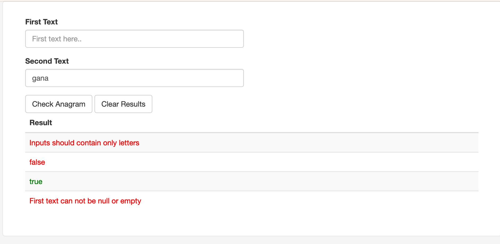

# Simple Anagram Checker Java Application


This application takes two words as input and creates a boolean(true/false) output as response by checking if two words are [anagrams](#1-what-is-an-anagram)

## 1. What is an Anagram

> [Wikipedia](https://en.wikipedia.org/wiki/Anagram): An anagram is a word or phrase formed by rearranging the letters of a different word or phrase, typically using all the original letters exactly once


## 2. Assumptions

- Inputs are case-insensitive.
- Strings should only contain UNICODE letters.
- Service has no states, anagram check attempts are not stored anywhere
- Input strings are not checked against any English vocabulary dictionary for validation, service does not know if input text are actual words with meaning.

## 3. Tech Stack

- Java 17
- Spring Boot 3.1.2
- Maven
- JUnit 5

## 4. How To Run

- Extract the zip and go to project root in terminal/console (For Linux: ```cd ~/anagram-checker```)
- First build the jar package with ```./mvnw clean install```
- Then in the same folder run the following command ```./mvnw spring-boot:run```
- Go to http://localhost:8080/index.html to check anagrams!



Check [AnagramCheckerService](/src/main/java/com/io/beyonnex/service/AnagramCheckerService.java) for algorithm details
## Thanks!